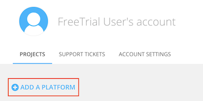
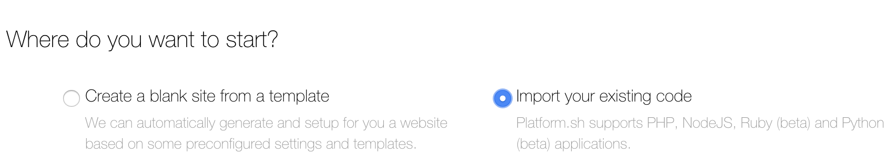
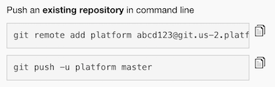
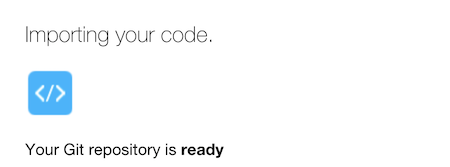

# Microservice Markdown Magic

This is a playground project to showcase some features of Platform.sh and demonstrate a microservices pattern.

The core of component of this project is `controller_microservice`, an app written in Golang to parse Markdown input and render it into HTML. It leverages https://github.com/gomarkdown/markdown, using it for its core functionality, plus some overrides.

### Inter-service communication

Communication with other microservices is enabled by the `PLATFORM_ROUTES` variable, populated through the [routes.yaml configuration file](.platform/routes.yaml). On each request, the controller will look at `PLATFORM_ROUTES` and `GET` the `/discover` path of each route found there. That request should return something like

```json
{
	"name": "pygments",
	"type": "*ast.CodeBlock",
	"attrs": {
		"language": "Info"
	},
	"flags": {
		"composable": false
	},
}
```

##### `name`

The service name

##### `type`

The type of Markdown element that the service can process. See [gomarkdown's AST documentation](https://godoc.org/github.com/gomarkdown/markdown/ast) for a list.

The three example microservices implement `*ast.CodeBlock`, `*ast.Text` and `*ast.Heading`.

##### `attrs`

This represents the attributes of the Markdown element you would like to pass to this microservice.

In the example above, this means the contents of the `Info` field of `CodeBlock` objects will be passed to the microservice in the `language` field. The [gomarkdown AST docs](https://godoc.org/github.com/gomarkdown/markdown/ast) have all the details on what is available.

##### `flags`

Static flags configuring this microservice. If a flag is absent, it is treated as false.

Currently only `composable` is implemented. This flag means that the service's rendered output is safe to feed into the next microservice (meaning it is likely plain text). Services that produce html shouldn't be flagged as `composable`, only those that output plain text should be (see the "redacted" service).

## Creating and configuring a Platform.sh project

Now that you understand what we are building, you can follow the steps below to create a project on Platform.sh and build this project.

### Create a development project on Platform.sh

1. [Create a free trial development account](https://accounts.platform.sh/platform/trial/general/setup) on Platform.sh. This development account will give you a project with all the features of a paid account, with the only limit being an inability to add a domain name to the project.

2. Check your email to validate your free trial. The validation link will bring you to your user dashboard.

3. Click on "Add a Platform" to create a new project.

   

4. Select a "Development" plan, and click "Continue" at the bottom of the page.

5. Finally, choose a region and data center, then click "Create Free Project".

6. A new project will now be created for you to experiment with.

### Set up your development environment

Now that your development project has been created, you need to add your code.

1. **Give your new project a name**, press "Next", and at the next prompt, select "Import your existing code".

   

2. At the next prompt, **add your public SSH key** to be able to upload your code. See our documentation on [Using SSH Keys](https://docs.platform.sh/development/ssh.html) if you need help with this.

3. Before we can move on to the next step, you need to **clone this repository** to your local machine with `git clone https://github.com/platformsh/apidays2018-workshop.git` and **change into the resulting directory** at `apidays2018-workshop`.

4. Back on the Platform.sh setup wizard, you will see two commands that you need to run to push this existing repository to the server. **Copy and execute these two commands.**

   

   The first command adds your new project as a remote repository to git, and the second pushes the local Master branch to the server.

In the setup wizard, you will now see that you code is being imported.

   

### Project deployment

In your terminal, you will see that after the code is pushed to the server, your new project is automatically being built and deployed on Platform.sh, for example:

```bash session
Validating submodules

Validating configuration files

Processing activity: User pushed to Master
    Found 33 commits

    Building application 'controller_microservice' (runtime type: golang:1.11, tree: f6ec1f2)
      Generating runtime configuration.

      Executing build hook...

	  Executing pre-flight checks...

      Compressing application.
      Beaming package to its final destination.

	. . .

	Building application 'pygments_microservice' (runtime type: python:3.5, tree: 5326a9f)
      Generating runtime configuration.

	. . .

	Building application 'redacted_microservice' (runtime type: ruby:2.4, tree: 51345c1)
      Generating runtime configuration.

      Executing build hook...

	. . .

	Building application 'app' (runtime type: golang:1.11, tree: 21d670f)
      Generating runtime configuration.

	. . .

	Provisioning certificates
      Validating 5 new domains
      Provisioned new certificate for 5 domains of this environment

	. . .

	Creating environment abcd123-master-7rqtwti
      Environment configuration
        controller_microservice (type: golang:1.11, size: S, disk: 1024)
        pygments_microservice (type: python:3.5, size: S, disk: 1024)
        redacted_microservice (type: ruby:2.4, size: S, disk: 256)
        svg_microservice (type: nodejs:10, size: S, disk: 512)
        app (type: golang:1.11, size: S, disk: 1024)

    . . .

    Environment routes
      http://controller.master-7rqtwti-abcd123.us-2.platformsh.site/ redirects to https://controller.master-7rqtwti-abcd123.us-2.platformsh.site/
      http://master-7rqtwti-abcd123.us-2.platformsh.site/ redirects to https://master-7rqtwti-abcd123.us-2.platformsh.site/

```

As you can see in your terminal output, each application in your repository has been built and deployed to its own container within your project cluster, a sub-domain has been created for each container, and a free TLS certificate has been provisioned for each domain.

To access the application, visit the primary domain that has been provisioned for your project. This will be the provisioned domain that lacks a sub-domain and fits the pattern `https://master-7rqtwti-YOURPROJECT.us-2.platformsh.site/`. In a production environment, you would instead visit your app's registered domain name.

Play around with the "Microservice Markdown Magic" web application to get a feel for the project.

## Project layout

To better understand how this project functions, explore the repository in your local environment. This project is organized with a separate directory for each microservice:

- [`webapp`](webapp/)

  The app that serves the frontend for the "Microservice Markdown Magic" web app.

- [`controller_microservice`](controller_microservice/)

  The Golang-based backend application that accepts input from the `webapp` and sends it to the other microservices for further processing.

- [`pygments_microservice`](pygments_microservice/)

  A Python-based microservice which accepts a Markdown-formatted code block and returns parsed HTML with code highlighting.

  As you can see in the application, specifying `js` after the opening code fence results in HTML output with Javascript code highlighting.

- [`redacted_microservice`](redacted_microservice/)

  A Ruby-based microservice with accepts text and replaces "senstive" text with a series of black squares. The sensitive text is detected by using the `confidential_info_redactor` Gem.

- [`svg_microservice`](svg_microservice/)

  A Node-based microservice which accepts Markdown-formatted text and returns an SVG for each heading detected in the input.

As you can see, each directory contains a `.platform.app.yaml` that configures how the microservice is built and deployed. The presence of a [`.platform.app.yaml` file](https://docs.platform.sh/configuration/app-containers.html) in a directory tells your project that the directory contains an application, and configures things such as the app's name, its dependencies, and any commands that should be used to build and deploy the app.

Within the [`.platform/`](.platform/) directory, there are two files which configure the project at a higher level:

- The `.platform/services.yaml` file is where you would configure any [additional services that Platform.sh supports](https://docs.platform.sh/configuration/services.html), such as databases, search engines, and message queues.
- The `.platform/routes.yaml` file is [where domains are mapped](https://docs.platform.sh/configuration/routes.html) to individual services. The information in this file is used by `controller_microservice` to discover other apps in the project.

## Exploring the current project

### Access your project via SSH

To access your project via SSH, hover over "Access site" near the top of the interface on your project dashboard, and copy the SSH command for the `controller_microservice` app, for example:

  ``` bash
  ssh PROJECTID-master-7rqtwti--controller_microservice@ssh.us-2.platform.sh
  ```

Alternatively, you can install the [Platform.sh CLI](https://docs.platform.sh/gettingstarted/cli.html) and access the `controller_microservice` app with the command:

  ``` bash
  platform ssh --environment master --app controller_microservice
  ```

 The CLI allows you to quickly access different apps deployed in different development environments within a project without having to know the exact URL every time.

### Explore routes

After you've accessed the `controller_microservice` via SSH, you can explore the route relationships that it is using to communicate with other microservices. The base64-encoding `$PLATFORM_ROUTES` environment variable contains information about all the apps running in your project. Print it out (using the `json.tool` Python module to pretty-print the result):

  ``` bash
  echo $PLATFORM_ROUTES | base64 -d | python -m json.tool
  ```

### View logging

Access one of the microservice apps via SSH to view logging as it processes input. For example,

``` bash
platform ssh --environment master --app pygments_microservice
tail -f /var/log/app.log
```

or

``` bash
ssh PROJECTID-master-7rqtwti--pygments_microservice@ssh.us-2.platform.sh
tail -f /var/log/app.log
```

When you make a change to the code block in the running web app, you will see the `pygments_microservice` add to its `app.log`.
